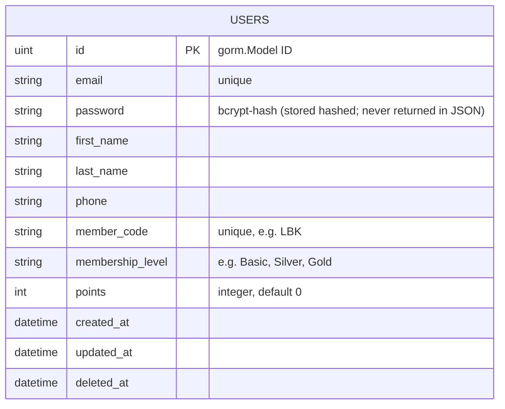

# backend-lab — Project Detail

This document describes the small Go HTTP service in this repository, explains architecture and patterns, and includes sequence and ER diagrams (Mermaid) to help understand flows and data model.

## Overview

- Language: Go
- Frameworks: Fiber (HTTP), GORM (ORM), SQLite (database)
- Auth: JWT (github.com/golang-jwt/jwt/v5)
- Password hashing: bcrypt (golang.org/x/crypto/bcrypt)
- DB file: `app.db` (created in project root by default)

The service implements: user register, login (returns JWT), and a user profile (GET/PUT) protected by a Bearer JWT middleware.

## Repository layout

- `main.go` — application entrypoint (DB init, AutoMigrate, route registration)
- `database/` — `database.go` (Init and global DB variable)
- `models/` — `user.go` (GORM model: embeds `gorm.Model`)
- `controllers/` — `auth.go` and `profile.go` (HTTP handlers)
- `routes/` — `routes.go` (route wiring, JWT middleware `AuthRequired`)
- `docs/` — `openapi.json` + `index.html` (Swagger UI)

## Setup & Run (macOS / zsh)

1. Ensure Go is installed (recommended >= 1.20).
2. At repo root run:

   go mod tidy
   go run .

3. The server listens on port 3000 by default (see `main.go`).

To build:

go build -o bin/app .

Reset DB (dev): delete `app.db` and restart the service (AutoMigrate will recreate tables).

## Configuration

- `JWT_SECRET` — secret used to sign JWTs (defaults to `secret` if not set)

## Model: User (high level)

- ID (uint, PK) — from `gorm.Model`
- Email (string, unique)
- Password (string, bcrypt hashed, `json:"-"` so it is never returned in responses)
- FirstName (string)
- LastName (string)
- Phone (string)
- MemberCode (string, generated at registration, e.g. `LBK<timestamp>`, unique)
- MembershipLevel (string, default `Basic`)
- Points (int, default 0)
- CreatedAt, UpdatedAt, DeletedAt (from GORM)

Behavioral notes:

- Password field must not be returned in JSON responses.
- MemberCode is generated during registration.

## Auth / JWT

- Register endpoint returns a signed JWT.
- Login verifies bcrypt password and returns signed JWT.
- JWT claims include `sub` (user ID) and `email`, and `exp`.
- Middleware `AuthRequired` expects header `Authorization: Bearer <token>` and sets `c.Locals("user")` to the DB user.

## API Endpoints (examples)

- POST /api/auth/register

  - Request JSON: { "email": "u@e.com", "password": "p" }
  - Response: { "token": "<jwt>" }

- POST /api/auth/login

  - Request JSON: { "email": "u@e.com", "password": "p" }
  - Response: { "token": "<jwt>" }

- GET /api/profile (protected)

  - Header: Authorization: Bearer <token>
  - Response: profile JSON (no password)

- PUT /api/profile (protected)
  - Body: fields to update (first_name, last_name, phone)

Example curl (register):

curl -X POST http://localhost:3000/api/auth/register \
 -H "Content-Type: application/json" \
 -d '{"email":"u@e.com","password":"p"}'

## Location of API docs

- `docs/openapi.json` describes Register, Login, Profile schemas and the BearerAuth security scheme.
- Swagger UI served from `/swagger` (static `docs/index.html`).

## Sequence Diagram (Mermaid)

## ER Diagram (Mermaid)

**Field notes:**

- password: always store and compare using bcrypt; never include in JSON responses (models use `json:"-"`).
- email and member_code: treated as unique identifiers in the application.
- timestamps: managed by GORM via `gorm.Model`.

## Notes for contributors

- Add new models under `models/` and include them in `main.go` AutoMigrate.
- Keep `docs/openapi.json` in sync when changing endpoints or request/response schemas.
- Map controller errors to appropriate Fiber status codes (e.g., `fiber.StatusBadRequest`, `fiber.StatusUnauthorized`).

## Troubleshooting

- If you change model fields and migrations fail, delete `app.db` during development and restart to allow AutoMigrate to recreate the schema.
- To inspect DB quickly, use `sqlite3 app.db` or a GUI SQLite viewer.

---

File created: `detail.md` — contains architecture overview, usage, API examples, and Mermaid diagrams for sequence and ER model.
